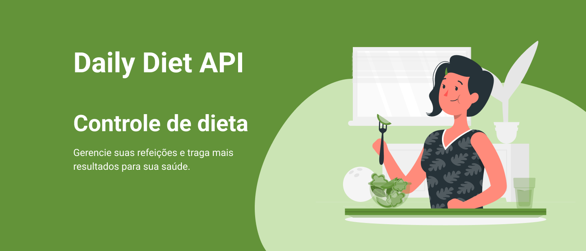

# 🍽️ Daily Diet API



Esta é a **Daily Diet API**, uma API em Node.js construída com Fastify. Ela permite que os usuários acompanhem suas refeições diárias e gerenciem sua dieta. A API integra-se com um banco de dados SQLite para desenvolvimento e utiliza o Knex para operações de banco de dados. Além disso, incorpora o Zod para validação de dados e outras bibliotecas.

## 📋 Funcionalidades

A Daily Diet API oferece os seguintes recursos:

- 👤 Gerenciamento de Usuários:
  - ✅ Criação de usuário
  - 🔐 Autenticação e autorização do usuário

- 🍽️ Acompanhamento de Refeições:
  - ✅ Registro de uma refeição com as seguintes informações:
    - Nome
    - Descrição
    - Data e Hora
    - Se a refeição está dentro do plano de dieta ou não
  - 🔄 Edição de uma refeição
  - ❌ Exclusão de uma refeição
  - 📜 Listagem de todas as refeições de um usuário
  - 🔍 Visualização de uma única refeição

- 📊 Cálculo de Métricas:
  - 📅 Número total de refeições registradas
  - 🥗 Número total de refeições dentro do plano de dieta
  - 🍔 Número total de refeições fora do plano de dieta
  - 🏆 Melhor sequência consecutiva de refeições dentro do plano de dieta por dia

## Pré-requisitos
Antes de executar a API, certifique-se de ter o seguinte instalado em sua máquina:

- 🚀 Node.js (versão 18 ou superior)
- ⚙️ NPM (gerenciador de pacotes do Node.js)

## 🚀 Instalando

Siga estes passos para configurar e executar a Daily Diet API:

1. Clone este repositório em sua máquina local:

   ```bash
   git clone https://github.com/gabrielvbauer/daily-diet-api.git
   ```

2. Navegue até o diretório do projeto:

   ```bash
   cd daily-diet-api
   ```

3. Instale as dependências necessárias:

   ```bash
   npm install
   ```

4. Execute a API:

   ```bash
   npm run dev
   ```

## ⚙️ Configuração

Antes de iniciar a API, você deve configurar as variáveis de ambiente. Crie um arquivo .env na raiz do projeto de acordo com o .env.example e ajuste as variáveis de ambiente de acordo com suas configurações.

## ▶️ Uso
Após concluir as etapas de instalação e configuração, você pode iniciar a API executando o seguinte comando:

```bash
   npm run dev
   ```
   
A API estará disponível no seguinte endereço: ``http://localhost:3333.``

## 📚 Documentação da API

A API possui os seguintes endpoints:

- Endpoints de Usuário:
  - `POST /users` - Criar um novo usuário
  - `POST /users/login` - Login do usuário (autenticação)
  - `GET /users/metrics` - Obter informações do usuário atual

- Endpoints de Refeição:
  - `POST /meals` - Criar uma nova refeição
  - `GET /meals` - Obter todas as refeições do usuário atual
  - `GET /meals/:id` - Obter uma refeição específica
  - `PATCH /meals/:id` - Atualizar uma refeição
  - `DELETE /meals/:id` - Excluir uma refeição

## 🛠️ Tecnologias Utilizadas

A Daily Diet API utiliza as seguintes tecnologias:

- TypeScript
- Node.js
- Fastify
- Knex
- Zod

Essas tecnologias foram escolhidas para fornecer uma base sólida para o desenvolvimento da API, permitindo a construção de uma aplicação eficiente e segura.

## 📄 Licença

Este projeto está licenciado sob a [Licença MIT](https://opensource.org/licenses/MIT).
